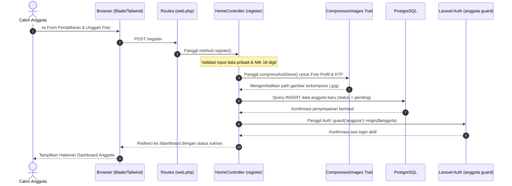
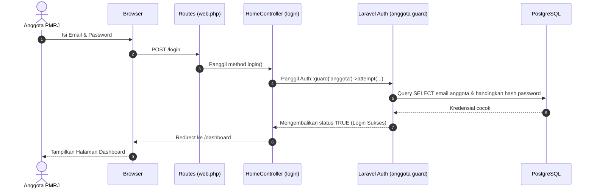
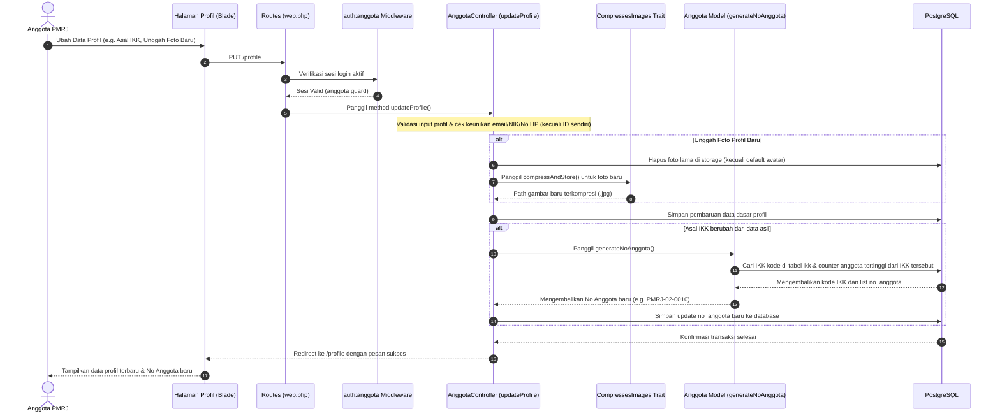

# Request Flow — Alur Permintaan Sistem PMRJ Anggota

Dokumen ini mendokumentasikan alur eksekusi request utama dalam aplikasi PMRJ Anggota.

---

## 1. Alur Registrasi Anggota Baru

Calon anggota melakukan pendaftaran melalui formulir pendaftaran di landing page publik.

---

## 2. Alur Autentikasi Login Anggota

Anggota terdaftar melakukan autentikasi untuk masuk ke dalam dasbor.

---

## 3. Alur Pembaruan Profil & Rekalkulasi Nomor Anggota

Anggota memperbarui profil diri dan mengubah pilihan kota asal IKK.

