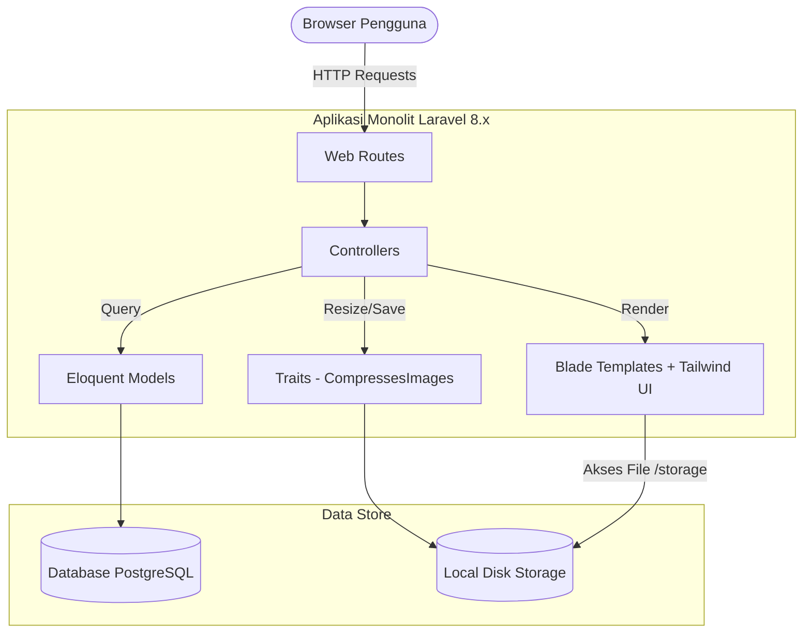

# System Overview — Arsitektur Sistem PMRJ Anggota

## Arsitektur Monolitik

Aplikasi **Sistem Informasi Anggota PMRJ** dibangun menggunakan pola arsitektur **Model-View-Controller (MVC) Monolitik** menggunakan framework Laravel 8.x. 

Semua antarmuka pengguna (UI), logika bisnis backend, dan interaksi database PostgreSQL dikemas di dalam satu unit repositori yang sama.

---

## Komponen Utama Sistem

### 1. Routing & Antarmuka (`routes/web.php` & `resources/views/`)
- Menangani rute publik (landing page, registrasi, login) dan rute terproteksi bagi anggota.
- Menggunakan Blade templating engine untuk menyusun halaman web secara dinamis dan responsif menggunakan utilitas styling Tailwind CSS.

### 2. Model & ORM (`app/Models/`)
- **Anggota**: Model inti autentikasi dan data anggota. Terhubung ke tabel `anggota`.
- **Ikk**: Model master IKK asal daerah Riau. Terhubung ke tabel `ikk`.
- Eloquent ORM digunakan untuk penulisan query yang aman dan bersih, serta mendefinisikan relasi belong-to antara `Anggota` dan `Ikk` melalui kolom `asal_ikk` dan `nama`.

### 3. Controller (`app/Http/Controllers/`)
- **HomeController**: Menangani pendaftaran warga baru, autentikasi login/logout, dan penampilan landing page publik.
- **AnggotaController**: Menangani rute dasbor pasca-login, penampilan KTA digital, pembaruan data profil, pembersihan berkas gambar lama, dan pembaruan nomor anggota jika IKK asal berubah.

### 4. Traits (`app/Traits/`)
- **CompressesImages**: Trait yang dapat digunakan kembali di kelas Controller mana pun untuk melakukan kompresi gambar profil anggota saat diunggah. Menggunakan library bawaan GD PHP.

---

## Skema & Model Database

### 1. Tabel Anggota (`anggota`)
Menyimpan seluruh data detail anggota PMRJ. Terdiri dari kolom:
- `id` (bigint, primary key)
- `nama_lengkap`, `nik`, `tempat_lahir`, `tanggal_lahir`, `jenis_kelamin`, `golongan_darah`, `no_hp`, `pekerjaan`, `alamat_jakarta`, `kota_bagian`, `asal_ikk`, `status_rumah`, `foto_ktp`, `foto`, `no_anggota`, `status`.
- `email` (string, unik)
- `password` (string, hashed)

### 2. Tabel Master IKK (`ikk`)
Menyimpan daftar IKK resmi untuk daerah Riau yang digunakan sebagai referensi asal anggota dan pembuatan penomoran anggota:
- `id` (bigint, primary key)
- `kode` (char 2 digit, unique, e.g. "01")
- `nama` (string, e.g. "Kota Pekanbaru")

### 3. Tabel Master Lainnya (Dibuat via Migrasi)
Tabel-tabel statis pendukung formulir profil:
- `jenis_kelamin`: ("Laki-laki", "Perempuan")
- `golongan_darah`: ("A+", "A-", "B+", "B-", "AB+", "AB-", "O+", "O-")
- `kota_bagian`: ("Jakarta Utara", "Jakarta Selatan", "Jakarta Barat", "Jakarta Timur", "Jakarta Pusat", dll)
- `status_rumah`: ("Rumah Tetap", "Rumah Kontrak")
