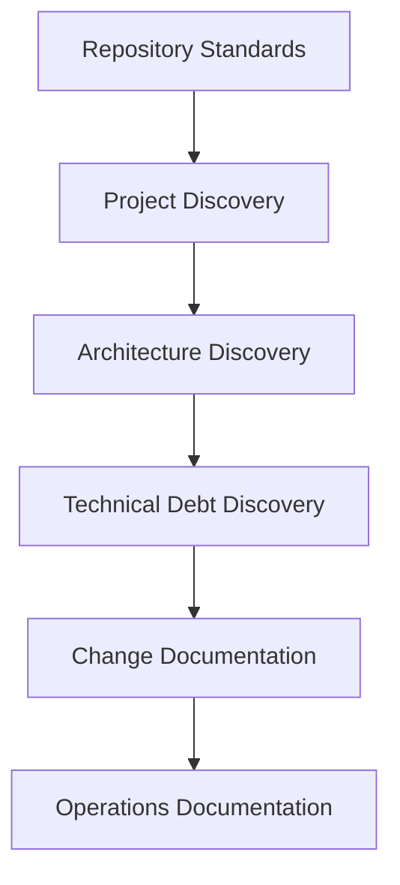
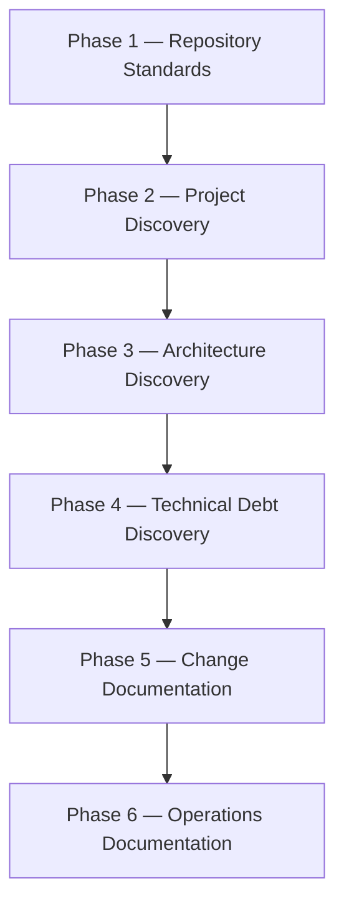
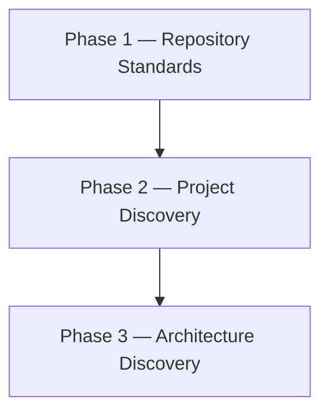

# Documentation Lifecycle

## Purpose

This document defines the recommended order for building and evolving repository documentation.

Documentation should be created incrementally as understanding of the system increases.

Do not generate all documentation at once.

Each phase should use knowledge gathered from previous phases.

---



---

# Phase 1 — Repository Standards

## Objective

Establish repository governance, engineering standards, and standard document templates.

## Deliverables

```text
AGENTS.md

docs/
├── engineering-standard.md
├── documentation-standard.md
├── documentation-lifecycle.md
└── templates/
    ├── ADR-template.md
    ├── CHG-template.md
    └── TD-template.md
```

## Outcome

The repository has defined standards for:

- AI agent behavior
- Engineering practices
- Documentation structure and lifecycle
- Reusable templates (ADRs, Change logs, Technical Debt analysis)

This phase should be completed before generating any project-specific documentation.

---

# Phase 2 — Project Discovery

## Objective

Understand the project domain, business purpose, and development conventions.

## Deliverables

```text
docs/project/
├── project-context.md
├── business-rules.md
├── glossary.md
└── coding-standards.md
```

## Outcome

The following knowledge is documented:

- Why the system exists
- What business problems it solves
- What major features it provides
- What constraints exist
- What development conventions are used

This phase creates a shared understanding of the project.

---

# Phase 3 — Architecture Discovery

## Objective

Understand how the system works internally.

## Deliverables

```text
docs/architecture/
├── system-overview.md
├── request-flow.md
├── security-model.md
├── integration-map.md
└── adr/
```

## Outcome

The following knowledge is documented:

- System architecture
- Request lifecycle
- Security model
- External integrations
- Architectural decisions

This phase creates a shared understanding of the system design.

---

# Phase 4 — Technical Debt Discovery

## Objective

Identify risks, code quality issues, and detailed technical debt analysis.

## Deliverables

```text
docs/backlog/
├── technical-debt.md
├── feature-backlog.md
├── roadmap.md
└── debt/
    ├── TD-001-*.md
    └── TD-XXX-*.md
```

## Outcome

The following knowledge is documented:

- Technical debt master index
- Planned features and roadmap
- Detailed technical debt analyses (security, performance, architectural debt)
- Prioritized work items

This phase creates visibility into future work and traceable engineering compromises.

---

# Phase 5 — Change Documentation

## Objective

Preserve implementation history and project evolution.

## Deliverables

```text
docs/changes/
├── active/
└── completed/
```

## Outcome

The following knowledge is documented:

- Significant changes
- Feature implementations
- Technical debt remediation
- Historical decisions

This phase preserves long-term project knowledge.

---

# Phase 6 — Operations Documentation

## Objective

Document how the system is deployed, operated, monitored, and recovered.

## Deliverables

```text
docs/operations/
├── deployment.md
├── rollback.md
├── runbook.md
├── troubleshooting.md
├── monitoring.md
└── disaster-recovery.md
```

## Outcome

The following knowledge is documented:

- Deployment procedures
- Rollback procedures
- Operational runbooks
- Monitoring practices
- Troubleshooting guidance
- Recovery procedures

This phase creates a complete operational knowledge base.

---

# Recommended Order For Existing Projects



Use this approach when introducing documentation into an existing repository.

---

# Recommended Order For New Projects



Additional documentation should be added as the project evolves.

Backlog, change history, testing, and operations documentation will naturally grow over time.

---

# Documentation Maintenance & Retention

## Maintenance Policy

Documentation should be updated whenever:

- Business behavior changes
- Architecture changes
- Security changes
- Operational procedures change

Documentation updates should be included as part of the same change/PR whenever practical to prevent documentation drift.

## Retention Policy

Historical repository knowledge must be preserved. When documentation becomes outdated:

* Prefer updating, archiving, or deprecating files.
* Avoid deleting files that contain historical business, architectural, or operational context.

---

# Guiding Principle

Documentation should evolve with the system.

Start with standards.

Then document the project.

Then document the architecture.

Everything else should grow naturally from those foundations.

The goal is not to create documents.

The goal is to build a maintainable knowledge system that helps engineers and AI agents understand, operate, and evolve the system safely.