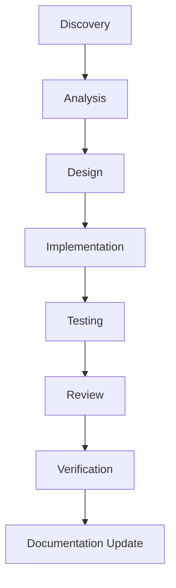

# Engineering Standard

## Purpose

This document defines the engineering principles, development workflow, change governance, and quality expectations used across all application repositories.

The objectives are:

* Maintain consistency across projects
* Improve software quality
* Reduce delivery risk
* Improve maintainability
* Support AI-assisted development
* Ensure safe and controlled system evolution

This document defines how software should be designed, implemented, tested, reviewed, and released.

---

# Engineering Principles

All engineering decisions should follow these principles.

## 1. Security First

Security requirements take precedence over convenience.

Systems should be designed to:

* Protect data
* Protect secrets
* Enforce authentication
* Enforce authorization
* Minimize attack surface

---

## 2. Maintainability First

Code should be easy to understand, modify, and extend.

Prefer:

* Simplicity
* Consistency
* Readability
* Clear ownership

Avoid unnecessary complexity.

---

## 3. Backward Compatibility First

Changes should avoid breaking existing consumers whenever possible.

Breaking changes must:

* Be explicitly documented
* Include migration guidance
* Include rollback plans

---

## 4. Observability By Default

Systems should be observable by design.

All services should provide:

* Structured logging
* Metrics
* Health checks
* Correlation identifiers
* Error visibility

---

## 5. Performance Awareness

Performance should be considered during design and implementation.

Evaluate:

* Latency
* Throughput
* Resource utilization
* Scalability

Avoid premature optimization while preventing obvious bottlenecks.

---

## 6. Small Incremental Changes

Prefer small, focused changes over large modifications.

Benefits:

* Easier review
* Lower risk
* Faster rollback
* Better traceability

---

## 7. Architecture Before Code

Implementation should follow an understood design.

Avoid coding directly from assumptions.

Understand:

* Business requirements
* Existing architecture
* System constraints
* Operational impact

before implementation begins.

---

# Change Categories

All work should belong to one of the following categories.

## Feature

Introduces new business capabilities.

Examples:

* New API
* New workflow
* New integration

---

## Bug Fix

Corrects unintended behavior.

Examples:

* Validation issue
* Incorrect routing
* Error handling defect

---

## Technical Debt

Improves system quality without introducing business functionality.

Examples:

* Refactoring
* Security remediation
* Performance optimization
* Dependency upgrades

---

## Operational Improvement

Improves system operability.

Examples:

* Monitoring improvements
* Deployment improvements
* Observability enhancements

---

# Engineering Workflow

All significant changes should follow the workflow below.



Workflow stages may be lightweight for small changes but should not be skipped.

---

# Discovery

Objective:

Understand the problem before proposing solutions.

Activities:

* Understand requirements
* Understand current behavior
* Identify constraints
* Identify affected components

Deliverable:

Problem definition.

---

# Analysis

Objective:

Evaluate impact and risks.

Activities:

* Risk analysis
* Dependency analysis
* Compatibility analysis
* Security analysis

Deliverable:

Impact assessment.

---

# Design

Objective:

Define the intended solution.

Activities:

* Evaluate options
* Identify trade-offs
* Define implementation approach

Deliverable:

Design proposal.

Large changes should be documented before implementation.

---

# Implementation

Objective:

Build the approved solution.

Requirements:

* Follow project coding standards
* Keep changes focused
* Avoid unrelated modifications
* Preserve existing behavior unless intentionally changed

Deliverable:

Working implementation.

---

# Testing

Objective:

Validate correctness and quality.

Testing should be proportional to risk.

Recommended validation areas:

* Functional testing
* Integration testing
* Regression testing
* Security testing
* Performance testing

Deliverable:

Validated implementation.

---

# Review

Objective:

Validate engineering quality.

Review focus:

* Correctness
* Maintainability
* Security
* Consistency
* Operational impact

Deliverable:

Approved change.

---

# Verification

Objective:

Confirm expected behavior after implementation.

Verify:

* Requirements satisfied
* No unexpected regressions
* Operational readiness

Deliverable:

Deployment-ready change.

---

# Documentation Update

Objective:

Keep repository knowledge accurate.

Documentation should be updated whenever:

* Business behavior changes
* Architecture changes
* Security changes
* Operational procedures change

Documentation is part of the implementation process.

---

# Pull Request Standards

## Preferred Size

```text
< 300 lines
```

---

## Maximum Recommended Size

```text
< 1000 lines
```

Large changes should be divided into smaller pull requests whenever practical.

---

# Code Review Standards

Reviews should focus on:

* Correctness
* Security
* Maintainability
* Performance
* Consistency

Reviews should avoid subjective style debates when standards already exist.

---

# Risk Classification

## Low Risk

Examples:

* Documentation updates
* Logging improvements
* Minor refactoring

---

## Medium Risk

Examples:

* New business rules
* New integrations
* Database changes

---

## High Risk

Examples:

* Authentication changes
* Authorization changes
* Security changes
* Infrastructure changes
* Architectural changes

High-risk changes require additional review and validation.

---

# Technical Debt Management

Technical debt should be visible and traceable.

All significant technical debt should be tracked through:

```text
docs/backlog/technical-debt.md
```

Detailed analysis should be documented in:

```text
docs/backlog/debt/
```

Technical debt remediation should be linked to change records.

---

# Definition Of Done

A change is considered complete when:

* Requirements are satisfied
* Code review is complete
* Testing is complete
* Risks are understood
* Documentation is updated
* Deployment readiness is verified

---

# Guiding Principle

Build systems that are secure, maintainable, observable, and understandable.

Prioritize long-term sustainability over short-term convenience.

Every change should leave the system equal to or better than it was before.